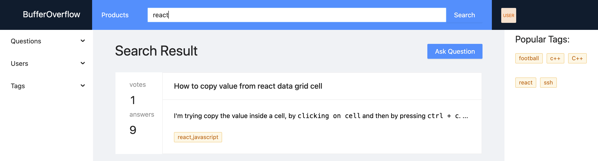

# BufferOverflow: Mini StackOverflow Website

## Demo
Deployed on Heroku: https://mini-stackoveflow.herokuapp.com/#/


## Local development setup 

<!-- **Step 1: Install dependencies** -->

Install NodeJS, npm and MongoDB on your OS. Then:

In the Server side:

```
cd server
npm install
npm run dev
```

In the Client side:

```
cd client 
npm install 
npm run serve
```

Build for development and run hot-reload website:

```
npm run serve
```

The default server connected in this setting is hosted at http://192.168.0.100:8081/. It might be slow when you open it sicne it will need a few seconds to relaod and restart. 


<!-- Build for development and run hot-reload website:

```
yarn run serve
``` -->


## Features 

- [x] User Authentication and Authorization
- [x] Create Question
- [x] Create Answer
- [x] Upvote Downvote Answer
- [x] Create Popular tags on main page
- [x] Serverside Pagination
- [x] Search keyword and return questions

## Snapshots

### Home Page


### Ask Question Page

### Answer Question Page


### Register Page


### Signin Page


### Search Result Page



## Debugging

https://github.com/Microsoft/vscode-recipes/tree/master/vuejs-cli

## Dependency management

Render dependency tree:

```
npm ls <package-name>
```

Upgrade general dependency:

```
npm upgrade <package-name>
```


